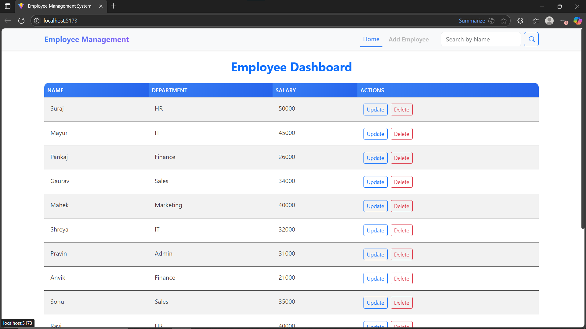
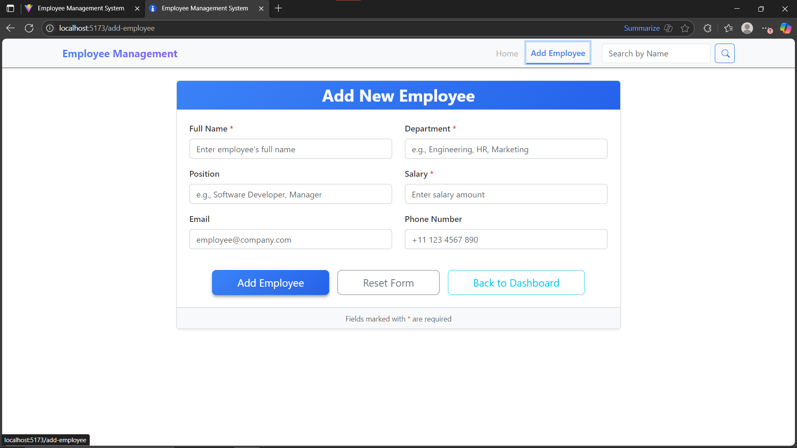
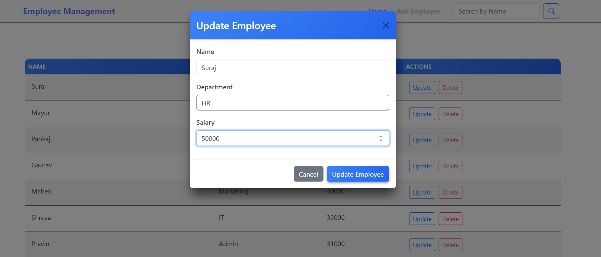
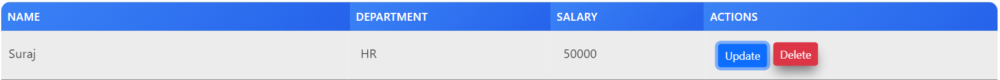
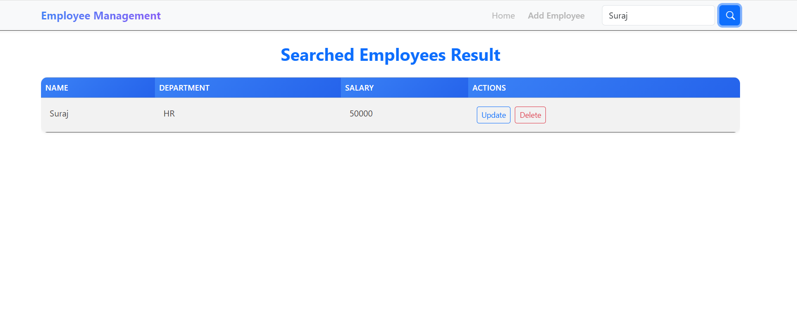
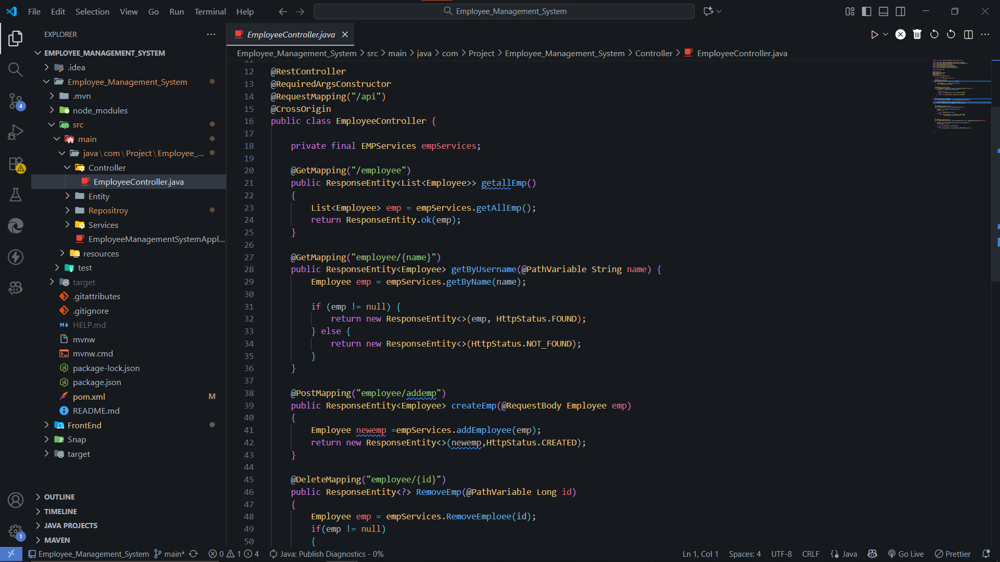

# Employee Management System

A comprehensive full-stack Employee Management System built with Spring Boot backend and React frontend. This application provides complete CRUD operations for managing employee data including employee information, department assignments, and salary management.

## 🚀 Features

### Backend Features (Spring Boot)
- **RESTful API** with complete CRUD operations
- **JPA/Hibernate** for database operations
- **MySQL Database** integration
- **Lombok** for reducing boilerplate code
- **Cross-Origin Resource Sharing (CORS)** enabled
- **Automatic database schema updates**
- **Sample data seeding** on application startup

### Frontend Features (React)
- **React Router DOM** for navigation
- **Modern UI/UX** design
- **Responsive design** for all devices
- **Real-time data synchronization** with backend

### Core Functionality
- ✅ **Create** new employees
- ✅ **Read/View** all employees and individual employee details
- ✅ **Update** employee information
- ✅ **Delete** employees
- ✅ **Search** employees by name
- ✅ **Department-wise** employee management
- ✅ **Salary management**

## 🛠️ Technology Stack

### Backend
- **Java 21**
- **Spring Boot 3.5.6**
- **Spring Data JPA**
- **Hibernate**
- **MySQL Database**
- **Maven** (Build Tool)
- **Lombok**

### Frontend
- **React**
- **React Router DOM 7.9.1**
- **Node.js**
- **npm**

### Database
- **MySQL 8.0+**

## 📋 Prerequisites

Before running this application, make sure you have the following installed:

- **Java 21** or higher
- **Maven 3.6+**
- **Node.js 14+** and **npm**
- **MySQL 8.0+**
- **Git**

## 🚀 Getting Started

### 1. Clone the Repository

```bash
git clone <repository-url>
cd Employee_Management_System
```

### 2. Database Setup

1. **Install MySQL** and create a database:
```sql
CREATE DATABASE employee_spring_db;
```

2. **Update database credentials** in `src/main/resources/application.properties`:
```properties
spring.datasource.username=your_username
spring.datasource.password=your_password
```

### 3. Backend Setup (Spring Boot)

1. **Navigate to project root directory**
2. **Install dependencies and run the application**:
```bash
# Using Maven wrapper (recommended)
./mvnw spring-boot:run

# Or using Maven directly
mvn spring-boot:run
```

The backend will start on `http://localhost:8080`

### 4. Frontend Setup (React)

1. **Install Node.js dependencies**:
```bash
npm install
```

2. **Start the React development server**:
```bash
npm start
```

The frontend will start on `http://localhost:3000`

## 📡 API Endpoints

The backend provides the following REST API endpoints:

| Method | Endpoint | Description |
|--------|----------|-------------|
| `GET` | `/api/employee` | Get all employees |
| `GET` | `/api/employee/{name}` | Get employee by name |
| `POST` | `/api/employee/addemp` | Create new employee |
| `PATCH` | `/api/employee/{id}` | Update employee by ID |
| `DELETE` | `/api/employee/{id}` | Delete employee by ID |

### API Examples

#### Get All Employees
```bash
curl -X GET http://localhost:8080/api/employee
```

#### Create New Employee
```bash
curl -X POST http://localhost:8080/api/employee/addemp \
  -H "Content-Type: application/json" \
  -d '{
    "name": "John Doe",
    "department": "Engineering",
    "salary": 75000
  }'
```

#### Update Employee
```bash
curl -X PATCH http://localhost:8080/api/employee/1 \
  -H "Content-Type: application/json" \
  -d '{
    "salary": 80000
  }'
```

- ImageShots :-
##  Main Page :-

| Page                     | Preview                                         |
| ------------------------ | ----------------------------------------------- |
| 🏠 **Home Page**         |             |
| 📂 **Add Employee Page** |  |
| ❤️ **Update Page**       |     |
| 🗑️ **Delete Page**      |        |
| 🔍 **Search Page**       |     |
| 🔗 **API Page**          |               |
| 📄 **API Page (v2)**     |          |

## 🗄️ Database Schema

### Employee Table (`employee_information`)

| Column | Type | Description |
|--------|------|-------------|
| `id` | BIGINT | Primary key (Auto-generated) |
| `name` | VARCHAR | Employee name |
| `department` | VARCHAR | Department name |
| `salary` | DOUBLE | Employee salary |

### Sample Data

The application comes pre-loaded with sample employee data including employees from various departments:
- HR Department
- IT Department  
- Finance Department
- Sales Department
- Marketing Department
- Admin Department

## 📁 Project Structure

```
Employee_Management_System/
├── src/
│   ├── main/
│   │   ├── java/
│   │   │   └── com/Project/Employee_Management_System/
│   │   │       ├── Controller/
│   │   │       │   └── EmployeeController.java
│   │   │       ├── Entity/
│   │   │       │   └── Employee.java
│   │   │       ├── Repository/
│   │   │       │   └── EmpRepo.java
│   │   │       ├── Services/
│   │   │       │   └── EMPServices.java
│   │   │       └── EmployeeManagementSystemApplication.java
│   │   └── resources/
│   │       ├── application.properties
│   │       ├── Data.sql
│   │       ├── static/
│   │       └── templates/
│   └── test/
├── package.json
├── pom.xml
└── README.md
```

## 🔧 Configuration

### Application Properties

Key configuration settings in `src/main/resources/application.properties`:

```properties
# Application name
spring.application.name=Employee_Management_System

# Database configuration
spring.datasource.url=jdbc:mysql://localhost:3306/employee_spring_db
spring.datasource.username=root
spring.datasource.password=your_password

# JPA/Hibernate configuration
spring.jpa.hibernate.ddl-auto=update
spring.jpa.show-sql=true
```

## 🧪 Testing

### Backend Testing
```bash
# Run all tests
./mvnw test

# Run specific test class
./mvnw test -Dtest=EmployeeManagementSystemApplicationTests
```

### API Testing
You can test the API endpoints using:
- **Postman**
- **curl** commands
- **REST Client** extensions in VS Code

## 🚀 Deployment

### Backend Deployment
1. **Build the JAR file**:
```bash
./mvnw clean package
```

2. **Run the JAR file**:
```bash
java -jar target/Employee_Management_System-0.0.1-SNAPSHOT.jar
```

### Frontend Deployment
1. **Build for production**:
```bash
npm run build
```

2. **Deploy the build folder** to your preferred hosting service (Netlify, Vercel, etc.)

## 🤝 Contributing

1. Fork the repository
2. Create a feature branch (`git checkout -b feature/AmazingFeature`)
3. Commit your changes (`git commit -m 'Add some AmazingFeature'`)
4. Push to the branch (`git push origin feature/AmazingFeature`)
5. Open a Pull Request

## 📝 License

This project is licensed under the MIT License - see the [LICENSE](LICENSE) file for details.

## 👥 Authors

- **Name** - *Initial work* - [MyGitHub](https://github.com/suraj-7874)

## 🙏 Acknowledgments

- Spring Boot community for excellent documentation
- React team for the amazing frontend framework
- MySQL for reliable database management
- Lombok for reducing boilerplate code

## 📞 Support

If you have any questions or run into issues, please:

1. Check the [Issues](https://github.com/yourusername/Employee_Management_System/issues) page
2. Create a new issue with detailed description
3. Contact the maintainers

---

**Happy Coding! 🎉**
